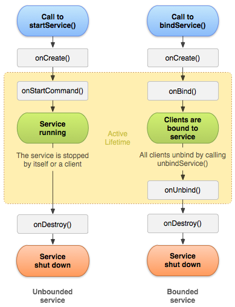

#### Activity

##### Activity生命周期
**onStart和onStop是从Activity是否可见这个角度来回调的**
**onResume和onPause是从Activity是否位于前台这个角度来回调的**

onRestart方法一般是用户行为所导致的，例如按Home键切换到桌面或者用户打开了一个新的Activity，接着用户又回到了这个Activity就会回调onRestart，接着会执行onStart。

问：在Activity A中启动Activity B时回调的顺序
答：正常情况下是 onPause (A) => onCreate (B) => onStart (B) => onResume (B) => onStop (A)

从上面可以看出，不能在onPause方法中执行耗时的操作，因为B必须要等到A的onPause执行完了之后才能启动，为了使得新Activity尽快显示在前台，可以将耗时操作放在onStop中完成。

**onSaveInstanceState方法只会在Activity被异常终止的情况下被回调**，例如Activity在后台并且系统内存不足或者屏幕旋转等系统配置发生变化的时候，系统将其杀死前会回调该方法以便Activity能够保存其数据和状态。**这个方法的调用时机是在onStop前，但是它和onPause没有既定的时序关系。**

**当Activity在异常情况下需要重新创建时，系统会默认为我们保存当前Activity的视图结构，并且在Activity重启后为我们恢复这些数据，比如文本框中用户输入的数据、listview滚动的位置等，这些view相关的状态系统都会默认为我们恢复。具体针对某一个view系统能为我们恢复哪些数据可以查看view的源码中的onSaveInstanceState和onRestoreInstanceState方法。**

当Activity被重建的时候，系统会将onSaveInstanceState保存的Bundle对象作为参数同时传给onRestoreInstanceState方法和onCreate方法。此外，系统自动帮我们处理了一些View的数据保存和恢复工作，实现方式是由Activity委托Window，Window再委托顶层容器ViewGroup(DecorView)，接着顶层容器再去通知它的子元素来保存数据，这样整个数据保存过程就完成了。

[http://www.jianshu.com/p/4f482548de59](http://www.jianshu.com/p/4f482548de59)
想要保存View的状态，需要在XML布局文件中提供一个唯一的ID(android:id)，如果没有设置这个ID的话，View控件的onSaveInstanceState是不会被调用的。
自定义View控件的状态被保存需要满足两个条件：
(1)View有唯一的ID
(2)View的初始化时要调用setSaveEnabled(true) 

**Activity的优先级**
前台Activity；可见但非前台Activity；后台Activity

**configChanges**
`android:configChanges="xxx"`属性，常用的主要有下面三个选项：
`local`：设备的本地位置发生了变化，一般指切换了系统语言；
`keyboardHidden`：键盘的可访问性发生了变化，比如用户调出了键盘；
`orientation`：屏幕方向发生了变化，比如旋转了手机屏幕。
配置了`android:configChanges="xxx"`属性之后，Activity就不会在对应变化发生时重新创建，而是调用Activity的`onConfigurationChanged`方法。

##### Activity启动模式
**standard**：标准模式
这是默认启动模式，每次都会创建新的实例

**singleTop**：栈顶复用模式
如果已经有一个该Activity的实例在任务栈并且它还是栈顶的话，就直接重用它

**singleTask**：栈内复用模式
如果已经有一个该Activity的实例在任务栈中，那么就会销毁它上面的所有Activity，并使其成为栈顶。当一个具有singleTask启动模式的Activity请求启动之后，系统首先会寻找是否存在Activity想要的任务栈，如果不存在，就重新创建一个任务栈，然后创建Activity的实例把它放到栈中；如果存在Activity所需的任务栈，这时候要看栈中是否有Activity实例存在，如果有，那么系统就会把该Activity实例调到栈顶，并调用它的onNewIntent方法(它之上的Activity会被迫出栈，所以**singleTask模式具有FLAG_ACTIVITY_CLEAR_TOP效果**)；如果Activity实例不存在，那么就创建Activity实例并把它压入栈中。

**singleInstance**：单实例模式
该Activity会在一个独立的任务栈中启动，并且这个任务栈中有且只有这一个实例。当再次启动该Activity的时候，会重用已存在的任务栈和实例。

一般复用原来的Activity实例的话都会回调实例的onNewIntent方法。
设置启动模式既可以使用xml属性`android:launchMode`，也可以使用代码`intent.addFlags()`。**区别在于限定范围不同，前者无法直接为Activity设置FLAG_ACTIVITY_CLEAR_TOP标识，而后者无法为Activity指定singleInstance模式。**

启动模式的深度理解：
[程序员何苦为难程序员 上](http://www.jianshu.com/p/cb5c4e5598ed)
[程序员何苦为难程序员 下](http://www.jianshu.com/p/e466b6390a7c)

问：当前应用有两个Activity A和B，B的 android:launchMode 设置了singleTask模式，A是默认的standard，那么A startActivity启动B，B会新启一个Task吗？如果不会，那么startActivity的Intent加上FLAG_ACTIVITY_NEW_TASK这个参数会不会呢？
答：设置了singleTask启动模式的Activity，它在启动的时会先在系统中查看属性值affinity等于它的属性值taskAffinity的任务栈是否存在。如果存在这样的任务栈，它就会在这个任务栈中启动，否则就会在新任务栈中启动。
当Intent对象包含FLAG_ACTIVITY_NEW_TASK标记时，系统在查找时仍然按Activity的taskAffinity属性进行匹配，如果找到一个任务栈的taskAffinity与之相同，就将目标Activity压入此任务栈中，如果找不到则创建一个新的任务栈。

设置了singleTask启动模式的Activity在已有的任务栈中已经存在相应的Activity实例，再启动它时会把这个Activity实例上面的Activity全部结束掉。也就是说singleTask自带clear top的效果。

**TaskStackBuilder**
如何实现从通知栏跳转到详情界面之后点击返回能够进入到应用主界面而不是系统主界面？
[http://blog.csdn.net/alone_slfly/article/details/41744323](http://blog.csdn.net/alone_slfly/article/details/41744323)

##### Activity任务栈
TaskAffinity参数，任务相关性，标识一个Activity所需的任务栈的名字。默认情况下，所有的Activity所需的任务栈的名字是应用的包名，当然也可以单独指定TaskAffinity属性。

任务栈分为前台任务栈和后台任务栈，后台任务栈中的Activity位于暂停状态，用户可以通过切换将后台任务栈再次调到前台。TaskAffinity属性主要和singleTask启动模式和allowTaskRepeating属性配对使用，在其他情况下使用没有意义。

当TaskAffinity和singleTask启动模式配对使用的时候，它是具有该模式的Activity的目前任务栈的名字，待启动的Activity会运行在名字和TaskAffinity相同的任务栈中；

当TaskAffinity和allowTaskReparenting结合的时候，当一个应用A启动了应用B的某个Activity C后，如果Activity C的allowTaskReparenting属性设置为true的话，那么当应用B被启动后，系统会发现Activity C所需的任务栈存在了，就将Activity C从A的任务栈中转移到B的任务栈中。

查看任务栈情况的方法是执行 adb shell dumpsys activity

##### Activity的标记位

Activity的标记位有`FLAG_ACTIVITY_NEW_TASK`,`FLAG_ACTIVITY_SINGLE_TOP`,`FLAG_ACTIVITY_CLEAR_TOP`等等。
`FLAG_ACTIVITY_EXCLUDE_FROM_RECENTS`：具有这个标记的Activity不会出现在历史Activity列表中，当某些情况下我们不希望用户通过历史列表回到我们的Activity的时候这个标记比较有用，它等同于属性设置`android:excludeFromRecents="true"`。

从非Activity类型的Context(例如ApplicationContext、Service等)中以`standard`模式启动新的Activity是不行的，因为这类context并没有任务栈，所以需要为待启动Activity指定`FLAG_ACTIVITY_NEW_TASK`标志位。

```
Intent demoIntent = new Intent(this, DemoActivity.class);
demoIntent.setFlags(Intent.FLAG_ACTIVITY_NEW_TASK);
startActivity(demoIntent);
```

##### IntentFilter的匹配规则
IntentFilter中的过滤信息有action、category、data，为了匹配过滤列表，需要同时匹配过滤列表中的action、category、data信息，否则匹配失败。**一个过滤列表中的action、category、data可以有多个，所有的action、category、data分别构成不同类别，同一类别的信息共同约束当前类别的匹配过程。只有一个Intent同时匹配action类别、category类别和data类别才算完全匹配，只有完全匹配才能成功启动目标Activity。此外，一个Activity中可以有多个intent-filter，一个Intent只要能匹配任何一组intent-filter即可成功启动对应的Activity。**
```
<intent-filter>
    <action android:name="com.ryg.charpter_1.c" />
    <action android:name="com.ryg.charpter_1.d" />

    <category android:name="com.ryg.category.c" />
    <category android:name="com.ryg.category.d" />
    <category android:name="android.intent.category.DEFAULT" />

    <data android:mimeType="text/plain" />
</intent-filter>
```

**action匹配规则**
只要Intent中的action能够和过滤规则中的任何一个action相同即可匹配成功，action匹配区分大小写。

**category匹配规则**
Intent中如果有category那么所有的category都必须和过滤规则中的其中一个category相同，如果没有category的话那么就是默认的category，即`android.intent.category.DEFAULT`，所以为了Activity能够接收隐式调用，配置多个category的时候必须加上默认的category。

**data匹配规则**
data的结构很复杂，语法大致如下：
```
<data android:scheme="string"
  android:host="string"
  android:port="string"
  android:path="string"
  android:pathPattern="string"
  android:pathPrefix="string"
  android:mimeType="string" />
```
主要由`mimeType`和`URI`组成，其中mimeType代表媒体类型，而URI的结构也复杂，大致如下：
`<scheme>://<host>:<port>/[<path>]|[<pathPrefix>]|[pathPattern]`
例如`content://com.example.project:200/folder/subfolder/etc`
`scheme、host、port`分别表示URI的模式、主机名和端口号，其中如果scheme或者host未指定那么URI就无效。
`path、pathPattern、pathPrefix`都是表示路径信息，其中path表示完整的路径信息，pathPrefix表示路径的前缀信息；pathPattern表示完整的路径，但是它里面包含了通配符(*)。

**data匹配规则：Intent中必须含有data数据，并且data数据能够完全匹配过滤规则中的某一个data。**

如果过滤规则中的mimeType指定为`image/*`或者`text/*`等这种类型的话，那么即使过滤规则中没有指定URI，**URI有默认的scheme是content和file**！如果过滤规则中指定了scheme的话那就不是默认的scheme了。
```
//URI有默认值
<intent-filter>
    <data android:mimeType="image/*"/>
    ...
</intent-filter>
//URI默认值被覆盖
<intent-filter>
    <data android:mimeType="image/*" android:scheme="http" .../>
    ...
</intent-filter>
```

**如果要为Intent指定完整的data，必须要调用`setDataAndType`方法！**
不能先调用setData然后调用setType，因为这两个方法会彼此清除对方的值。
```
intent.setDataAndType(Uri.parse("file://abc"), "image/png");
```

data的下面两种写法作用是一样的：
```
<intent-filter>
    <data android:scheme="file" android:host="www.github.com"/>
</intent-filter>

<intent-filter>
    <data android:scheme="file"/>
    <data android:host="www.github.com"/>
</intent-filter>
```

**如何判断是否有Activity能够匹配我们的隐式Intent？**
(1)`PackageManager`的`resolveActivity`方法或者Intent的`resolveActivity`方法：如果找不到就会返回null
(2)PackageManager的`queryIntentActivities`方法：它返回所有成功匹配的Activity信息
针对Service和BroadcastReceiver等组件，PackageManager同样提供了类似的方法去获取成功匹配的组件信息，例如`queryIntentServices`、`queryBroadcastReceivers`等方法

有一类action和category比较重要，它们在一起用来标明这是一个入口Activity，并且会出现在系统的应用列表中。
```
<intent-filter>
    <action android:name="android.intent.action.MAIN" />
    <category android:name="android.intent.category.LAUNCHER" />
</intent-filter>
```

##### Activity的启动流程

参见Android开发艺术探索的读书笔记

Instrumentation会对将启动的Activity进行检查
AMS是ActivityManagerNative的子类，继承自Binder，并实现了IActivityManager接口
ActivityThread将创建新Activity的对象并启动它

#### Broadcast 和 BroadcastReceiver

##### Broadcast的种类
**Normal broadcasts**
sendBroadcast，无序广播，会异步的发送给所有的Receiver，接收到广播的顺序是不确定的，有可能是同时。

**Ordered broadcasts**
sendOrderBroadcast，有序广播，广播会先发送给优先级高的Receiver，而且这个Receiver有权决定是继续发送到下一个Receiver或者是直接终止广播。

BroadcastReceiver优先级的设置是通过receiver的IntentFilter中的android:process 属性来设置，数值越大优先级越高。

```
<receiver android:name="xxx">
    <intent-filter android:priority="100">
        <action android:name="yyy">
    </intent-filter>
</receiver>
```

**Sticky broadcasts**
sendStickyBroadcast，此方法发送的广播会一直滞留，当有匹配此广播的广播接收器被注册的时候，该广播接收器就会收到这条广播。也就是说在发送广播时Reciever还没有被注册，但它注册后还是可以收到在它之前发送的那条广播。发送这类广播需要申请BROADCAST_STICKY权限。

**Local broadcasts**
本地广播，只有本进程中的receivers能接收到此广播，它是在21版的support v4包中新增的广播，使用LocalBroadcastManager来发送本地广播。

LocalBroadcastManager的实现原理是使用Handler往主线程的消息池（Message Queue）发送消息，只有主线程的Handler可以分发处理它，广播发送的内容是一个Intent对象，我们可以直接用Message封装一下，留一个和sendBroadcast一样的接口。在handleMessage时把Intent对象传递给已注册的Receiver。

```java
//LocalBroadcastManager的构造方法，创建了一个Handler
private LocalBroadcastManager(Context context) {
    mAppContext = context;
    mHandler = new Handler(context.getMainLooper()) {

        @Override
        public void handleMessage(Message msg) {
            switch (msg.what) {
                case MSG_EXEC_PENDING_BROADCASTS:
                    executePendingBroadcasts();
                    break;
                default:
                    super.handleMessage(msg);
            }
        }
    };
}

//取出广播数据，依次调用监听该广播的Receiver的onReceive方法
private void executePendingBroadcasts() {
    while (true) {
        BroadcastRecord[] brs = null;
        synchronized (mReceivers) {
            final int N = mPendingBroadcasts.size();
            if (N <= 0) {
                return;
            }
            brs = new BroadcastRecord[N];
            mPendingBroadcasts.toArray(brs);
            mPendingBroadcasts.clear();
        }
        for (int i=0; i<brs.length; i++) {
            BroadcastRecord br = brs[i];
            for (int j=0; j<br.receivers.size(); j++) {
                br.receivers.get(j).receiver.onReceive(mAppContext, br.intent);
            }
        }
    }
}
```

##### BroadcastReceiver的生命周期
BroadcastReceiver的生命周期很短，当它的onReceive方法执行完成后，它的生命周期就结束了。这时BroadcastReceiver已经不处于active状态，被系统杀掉的概率极高。如果在onReceive去开线程进行异步操作或者打开Dialog都有可能在没完成之前进程就被系统杀掉了，因为这个进程可能只有这个Receiver这个组件在运行，当Receiver也执行完后就是一个empty进程，是最容易被系统杀掉的。

替代的方案是用Notificaiton或者Service，例如，在onReceive里启动一个Service，让这个Service去做事情，那么系统就会认为这个进程里还有组件正在进行，但是注意不能使用子线程来解决，因为可能子线程还没有执行完成这个进程就结束了。

##### BroadcastReceiver的注册方式
**冷注册**：Broadcast Receiver的相关信息写在配置文件中，系统会负责在相关事件发生的时候及时通知到该Broadcast Receiver。

**热注册**：通常是在onResume方法中通过registerReceiver进行注册，在onPause方法中通过unregisterReceiver反注册，通过这种方式使其能够在运行期间保持对相关事件的关注。

[http://www.jianshu.com/p/ae6e1d93cc8e](http://www.jianshu.com/p/ae6e1d93cc8e)
这篇文章认为应该是在onStart和onStop方法中对广播进行注册和反注册，个人认为这个更合适。

对于有序消息，动态注册的BroadcastReceiver总是先于静态注册的BroadcastReceiver被触发。
对于同样是动态注册的BroadcastReceiver，优先级别高的将先被触发，而静态注册的 BroadcastReceiver总是按照静态注册的顺序执行。

**优先级高的动态注册 > 优先级低的动态注册 > 先注册的静态注册 > 后注册的静态注册**

<u>疑惑：在AndroidManifest文件中给定了 android:process 属性值，但是receiver依然是在应用主进程的主线程中执行的。此外，BroadcastReceiver创建的时候Application并不会再次创建，因为并没有启动新的进程。</u>

#### Service
Service只是在后台运行的一个组件，默认情况下，Service也是运行在app的主线程中的，它并不会开启新的线程或者进程（当然，这个是可以做到的）。所以，假如在Service中执行耗时操作的话，最好在Service中开启子线程处理或者让Service运行在新的进程里面。

Service更像是一个独立的服务，一个Service除了被自身的app组件所用外，还可以被其它的app调用（可以通过在 android:exported 属性中设置是否允许其它app使用自己的Service），当然，可以是跨进程的调用。

##### service的启动方式
**Started形式（可启动）**
该类Service需要实现onStartCommand()方法。由一个其它的android组件来启动一个Service，可以调用startService()方法来实现。这种形式的Service的特点是，一旦Service启动完成后，该Service便会在后台独立地运行，不再受启动它的组件的生命周期的影响。通常来说，该类Service再被启动后做一些不用给启动者返回值的操作，因为该类Service的生命周期要比启动它的组件的要长，所以假如该类Service返回结果的话，无法确定它的启动者是否还活着。*举例来说，该类Service就像是扫地机器人，主人把它打开后它就会负责再家中打扫卫生，不管主人是不是还在家，它也不需要报告主人打扫的怎么样了。* 当该类Service的工作完成后，它应该自己停止自己。当然，其它组件也可以在Service运行的时候选择停止它。

**Bound形式（可绑定）**
该类Service需要实现onBind()方法，并返回一个IBinder类型的实例。一个android组件通过调用bindService()方法来启动一个Service，这个时候该启动者组件会与Service实例形成一个Client－Service结构。Service会提供服务端的接口以便Client端和它进行交互。调用者可以给该类Service发请求，获取结果，委派其完成任务等。*该类Service只有在其它组件和其绑定的时候才会启动，而且允许多个不同的组件和它进行绑定。当一个与Service绑定的组件都没有了的时候，该Service实例就会被销毁。*

以上两种形式的Service也可以同时使用，只要把onStartCommand() 和 onBind()两个方法同时实现就可以了。这样的话，得到的Service将会具有以上两者的特性。

*同一个Service的类在android中可以有多个实例吗？*
答：不可以。Service的启动模式决定它不会在系统中存在多个实例，当有新的Intent传递过来的时候，android系统会直接使用已经存在的Service实例而不会重新创建，所以**在android系统中的Service都是单例的**。

##### service的生命周期



##### service的回收和重建
Android系统中，当剩余内存紧急的时候，系统为了保证用户正在进行的工作正常进行以及系统关键的功能能够正常工作，会对已经使用的内存进行部分回收，并把那些不再重要的进程、Activity实例、Service实例等进行销毁，所以用户的Service是随时可能被回收的。

Android的设计哲学是让app尽可能久的运行，所以，当机器的内存危机过去之后，Android系统会再尝试重建曾经被销毁的实例，比如Service对象就可以被系统再重新创建，并继续之前的工作。

Service的onStartCommand()方法的返回值是一个整数，取值必须是这几个中的一个Service.START_NOT_STICKY、Service.START_STICKY、Service.START_REDELIVER_INTENT，这几个返回值会影响到Android系统对Service的重建。当然，这里的Service指的是“可启动”的Service。这几个值对Service重建的影响如下：

**Service.START_NOT_STICKY**
如果系统在Service的onStartCommand方法回调过之后销毁了该Service，系统不会主动重建该Service，直到有新的组件来启动它。系统对待该Service的态度是，销毁就销毁了，无所谓。

**Service.START_STICKY**
如果系统在Service的onStartCommand方法回调过之后销毁了该Service，系统会主动重新创建该Service的对象，会重新调用该Service的OnStartCommand方法，但是传递进去的Intent对象是一个null。系统对待该Service的态度是，等内存不那么紧张的时候重建该Service，但是并不会给它传递Intent对象，而是传递null。

**Service.START_REDELIVER_INTENT**
如果系统在Service的onStartCommand方法回调过之后销毁了该Service，系统会主动重新创建该Service的对象，会重新调用该Service的OnStartCommand方法，并且把上销毁前的最后一个Intent对象传递进去，主要用在需要恢复现场的地方，比如下载文件。系统对待该Service的态度是，等内存不那么紧张的时候重建该Service，并且会把销毁前最后一个Intent对象重新传递进去。

##### 前台service
前台service可以调用startForeground方法来实现，通常在该方法中需要指定一个不间断的Notification，这个Notification存在的时间与跑在前台的Service相同，当然也可以不显示这个Notification。

```java
private void startForeground() {
   Intent monitorIntent = new Intent(this, WukongMonitorActivity.class);
   PendingIntent pendingIntent = PendingIntent.getActivity(this, 0, monitorIntent, 0);
    
   Notification.Builder builder = new Notification.Builder(this).setSmallIcon(R.drawable.ic_wukong_monitor).setTicker(getString(R.string.wukong_monitor_title))
           .setContentText(getString(R.string.keep_running_background)).setContentTitle(getString(R.string.wukong_monitor_title))
           .setContentIntent(pendingIntent);
    
   startForeground(214, builder.build());
}
```

##### IntentService
IntentService源码：[http://androidxref.com/6.0.0_r1/xref/frameworks/base/core/java/android/app/IntentService.java](http://androidxref.com/6.0.0_r1/xref/frameworks/base/core/java/android/app/IntentService.java)

IntentService的特点是同步地接收多个start请求，一个接一个地处理它们，并且IntentService里面处理start请求的是在一个独立的线程里进行的，所以可以用来执行耗时的操作而不影响主线程中UI的绘制。使用的时候只需要实现onHandleIntent()方法来接收其它组件传递过来的Intent对象就可以了。IntentService的实现原理是 HandlerThread + Looper + Handler，主要代码如下：

```java
//onCreate
HandlerThread thread = new HandlerThread("IntentService[" + mName + "]");
thread.start();
mServiceLooper = thread.getLooper();
mServiceHandler = new ServiceHandler(mServiceLooper);

//ServiceHandler
private final class ServiceHandler extends Handler {
   public ServiceHandler(Looper looper) {
       super(looper);
   }

   @Override
   public void handleMessage(Message msg) {
       onHandleIntent((Intent)msg.obj);
       stopSelf(msg.arg1);
   }
}
```

##### service和线程

如果只是需要在当前界面去做一些耗时操作，界面退出或改变时，工作也要停止，那么这时直接使用Thread（或者AsyncTask, HandlerThread）会更合适。

##### AIDL

推荐阅读《Android开发进阶：从小工到专家》第一章 1.3节，下面摘录其中的部分重要内容

aidl工具自动生成的接口中有两个重要的类Stub和Proxy，两者都实现了AIDL定义的接口类型。
Stub中最重要的就是asInterface方法，在这个方法中会判断obj参数的类型，如果obj是本地的接口类型，则认为不是进程间调用，此时将该obj转换成接口类型；否则会通过自动生成另一个内部类Proxy来包装obj，将其赋值给Proxy中的mRemote字段。Proxy类也实现了接口，但是它是通过Binder机制来与远程进程进行交互。

理解AIDL的白话：两个公司打算合作，但是两个Boss都太忙，合同签署完成之后就交给各自的助理Proxy去代理完成合同的细节问题的商定。
其中两个Boss分别对应客户端和服务端，合同对应服务的接口，两个代表对应两端的Proxy，代表的通信方式则是电话，而代码的通信方式是Binder。

#### ContentProvider
**ContentProvider的作用**
1.封装数据：对数据进行封装，提供统一的接口
2.跨进程的数据共享

**ContentProvider数据访问限制**
android:exported 属性用于指示该服务是否能够被其他应用程序组件调用或跟它交互。如果设置为true，则能够被调用或交互。如果设置为false时，只有同一个应用程序的组件或带有相同用户ID的应用程序才能启动或绑定该服务。

对于需要开放的组件应设置合理的权限，如果只需要对同一个签名的其它应用开放content provider，则可以设置signature级别的权限。

**ContentProvider运行的进程和线程**
ContentProvider可以在AndroidManifest.xml中配置一个叫做android:multiprocess 的属性，默认值是false，表示ContentProvider是单例的，无论哪个客户端应用的访问都将是同一个ContentProvider对象。如果设为true，系统会为每一个访问该ContentProvider的进程创建一个实例。

问：每个ContentProvider的操作是在哪个线程中运行的呢（其实我们关心的是UI线程和工作线程）？比如我们在UI线程调用getContentResolver().query查询数据，而当数据量很大时（或者需要进行较长时间的计算）会不会阻塞UI线程呢？
答：**ContentProvider和调用者在同一个进程，ContentProvider的方法（query/insert/update/delete等）和调用者在同一线程中；**
**ContentProvider和调用者在不同的进程，ContentProvider的方法会运行在它自身所在进程的一个Binder线程中。**

问：ContentProvider是如何在不同应用程序之间传输数据的？
答：**ContentResolver虽然是通过Binder进程间通信机制打通了应用程序之间共享数据的通道，但Content Provider组件在不同应用程序之间传输数据是基于匿名共享内存机制来实现的。**

**一个应用进程有16个Binder线程去和远程服务进行交互，而每个线程可占用的缓存空间是128KB这样，超过会报异常。**


#### 参考资料
1.《Android开发群英传》
2.《Android开发进阶：从小工到专家》
3.《Android开发艺术探索》
4.[Android后台服务 Service](http://my.oschina.net/wangjunhe/blog/113286)
5.[Android组件 Service研究](http://android.jobbole.com/84450/)
6.[Android面试一天一题](http://www.jianshu.com/p/7a7db9f8692d)
7.[用广播来更新UI界面好吗](http://www.jianshu.com/p/df7af437e766)
8.[Android广播接收器 BroadcastReceiver](http://uule.iteye.com/blog/1707341)

