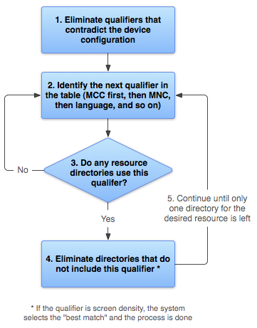

#### Handler机制
**Message**：消息分为硬件产生的消息(如按钮、触摸)和软件生成的消息；
**MessageQueue**：消息队列的主要功能向消息池投递消息(MessageQueue.enqueueMessage)和取走消息池的消息(MessageQueue.next)；
**Handler**：消息辅助类，主要功能向消息池发送各种消息事件(Handler.sendMessage)和处理相应消息事件(Handler.handleMessage)；
**Looper**：不断循环执行(Looper.loop)，按分发机制将消息分发给目标处理者。

Handler容易引起内存泄露的原因：非静态内部类和匿名内部类都持有对外部类的引用。
[http://droidyue.com/blog/2014/12/28/in-android-handler-classes-should-be-static-or-leaks-might-occur/](http://droidyue.com/blog/2014/12/28/in-android-handler-classes-should-be-static-or-leaks-might-occur/)

如何避免Handler引起的内存泄露？使用静态内部类和弱引用来解决这个问题。
```java
private static class MyHandler extends Handler {
	private final WeakReference<SampleActivity> mActivity;

	public MyHandler(SampleActivity activity) {
		mActivity = new WeakReference<SampleActivity>(activity);
	}

	@Override
	public void handleMessage(Message msg) {
		SampleActivity activity = mActivity.get();
		if (activity != null) {
			// ...
		}
	}
}

private final MyHandler mHandler = new MyHandler(this);
```

#### Parcelable
Serializable和Parcelable的区别
**Serializalbe会使用反射，序列化和反序列化过程需要大量I/O操作。Parcelable自已实现封送和解封（marshalled &unmarshalled）操作不需要用反射，数据也存放在Native内存中，效率要快很多。**

Parcelable和Parcel的区别
**Parcelable 接口定义在封送/解封送过程中混合和分解对象的契约，Parcelable接口的底层是Parcel容器对象。Parcel类是一种最快的序列化/反序列化机制，专为Android中的进程间通信而设计。该类提供了一些方法来将成员容纳到容器中，以及从容器展开成员。**

Activity之间传递参数时要注意对象的大小，Intent中的Bundle是在使用Binder机制进行数据传递的，能使用的Binder的缓冲区是有大小限制的（有些手机是2M），而一个进程默认有16个binder线程，所以一个线程能占用的缓冲区就更小了（以前做过测试，大约一个线程可以占用128KB），所以当看到“The Binder transaction failed because it was too large.” 这类TransactionTooLargeException异常时就说明传递的参数太大了，需要精简。使用Intent在Activity之间传递List和Bitmap对象是有风险的。

参考资料    
[http://www.jianshu.com/p/be593134eeae](http://www.jianshu.com/p/be593134eeae)

#### ListView

**ListView的优化**
问：getView的执行时间应该控制在多少以内？
答：1秒之内屏幕可以完成30帧的绘制，这样人看起来会觉得比较流畅（苹果手机是接近60帧，高于60之后人眼也无法分辨）。每帧可使用的时间：1000ms/30 = 33.33 ms
每个ListView一般要显示6个ListItem，加上1个重用convertView：33.33ms/7 = 4.76ms
即是说，每个getView要在4.76ms内完成工作才会较流畅，但是事实上，每个getView间的调用也会有一定的间隔（有可能是由于handler在处理别的消息），UI的handler处理不好的话，这个间隔也可能会很大（0ms-200ms）。结论就是，留给getView使用的时间应该在4ms之内，如果不能控制在这之内的话，ListView的滑动就会有卡顿的现象。

优化建议：
1.重用ConvertView;
2.使用View Holder模式；
3.使用异步线程加载图片（一般都是直接使用图片库加载，如Glide, Picasso）；
4.在adapter的getView方法中尽可能的减少逻辑判断，特别是耗时的判断；
5.避免GC（可以从logcat中查看有无GC的LOG）；
6.在快速滑动时不要加载图片；
7.将ListView的scrollingCache和animateCache这两个属性设置为false（默认是true）;
8.尽可能减少List Item的Layout层次（如可以使用RelativeLayout替换LinearLayout，或使用自定的View代替组合嵌套使用的Layout）；
9.使用硬件加速来解决莫名的卡顿问题，给Activity添加配置`android:hardwareAccelerated="true"`；

关于第6点快速滑动时不要加载图片的优化实现原理：
在适配器中声明一个全局的boolean变量用来保存此刻是否在滚动，然后通过给ListView设置滚动监听，然后在滚动监听器的onScrollStateChanged()方法中给boolean值赋值，看是否在滚动。 
这样在我们使用这个适配器的时候，就可以根据滚动状态的不同来判断：比如正在滚动的时候就只显示内存缓存的图片，如果内存缓存中没有就显示一张默认图片；而如果没有在滚动就采用正常的图片加载方案去加载网络或者缓存中的图片。

关于第7点设置在某些型号的手机上效果比较明显
android:scrollingCache="false" 
android:animationCache="false"

参考资料    
[http://www.jianshu.com/p/8fd5fa90ee6c](http://www.jianshu.com/p/8fd5fa90ee6c)
[http://www.kymjs.com/code/2015/04/28/01/](http://www.kymjs.com/code/2015/04/28/01/)

#### SharedPreferences

**commit和apply的区别**
commit是同步的提交，这种方式很常用，在比较早的SDK版本中就有了。这种提交方式会阻塞调用它的线程，并且这个方法会返回boolean值告知保存是否成功（如果不成功，可以做一些补救措施）。
apply是异步的提交方式，目前Android Studio也会提示大家使用这种方式。

**注册监听器监听键值变化**
SharedPreferences提供了registerOnSharedPreferenceChangeListener方法来注册监听器

**多进程操作和读取SharedPreferences**
在Android 3.0及以上版本，可以通过`Context.MODE_MULTI_PROCESS`属性来实现SharedPreferences多进程共享，但是6.0的版本将这个MODE_MULTI_PROCESS标识为deprecated，因为它容易出现问题。

SharedPreferences的多进程共享数据的替代品[https://github.com/grandcentrix/tray](https://github.com/grandcentrix/tray)

#### SQLite

SQLite每个数据库都是以单个文件（.db）的形式存在，这些数据都是以B-Tree的数据结构形式存储在磁盘上。

使用SQLiteDatabase的insert，delete等方法或者execSQL方法默认都开启了事务，如果操作的顺利完成才会更新.db数据库。事务的实现是依赖于名为rollback journal文件，借助这个临时文件来完成原子操作和回滚功能。在/data/data/<packageName>/databases/目录下看到一个和数据库同名的.db-journal文件。

问：如何对SQLite数据库中进行大量的数据插入？
答：可以通过“**SQLiteStatement+事务**”的方式来提高效率。

查询方面的优化一般可以通过建立索引。建立索引会对插入和更新的操作性能产生影响，使用索引需要考虑实际情况进行利弊权衡，对于查询操作量级较大，业务对要求查询要求较高的，还是推荐使用索引。

SQLite的同步锁精确到数据库级，粒度比较大，不像别的数据库有表锁，行锁。同一个时间只允许一个连接进行写入操作。

#### Resources

**资源的查找顺序**
在查找时会先去掉有冲突的资源目录，然后再按MCC、MNC、语言等指定的优先级进行查找，直到确认一个匹配资源。根据屏幕尺寸限定符选择资源时，如果没有更好的匹配资源，则系统将使用专为小于当前屏幕的屏幕而设计的资源。

MCC 移动国家码，由3为数字组成；MNC 移动网络码，由2位数字组成 ?  


**图片的放置位置问题**
如果能提供各种dpi的对应资源那是最好，可以达到较好内存使用效果。如果提供的图片资源有限，那么图片资源应该尽量放在**高密度文件夹**下，这样可以节省图片的内存开支。

**res/raw 和 assets 的区别**
这两个目录下的文件都会被打包进APK，并且不经过任何的压缩处理。
assets与res/raw不同点在于，assets支持任意深度的子目录，这些文件不会生成任何资源ID，只能使用AssetManager按相对的路径读取文件。如需访问原始文件名和文件层次结构，则可以考虑将某些资源保存在assets目录下。

**drawable-nodpi**
drawable-nodpi文件夹是一个密度无关的文件夹，放在这里的图片系统就不会对它进行自动缩放，原图片是多大就会实际展示多大。但是要注意一个加载的顺序，drawable-nodpi文件夹是在匹配密度文件夹和更高密度文件夹都找不到的情况下才会去这里查找图片的，因此放在drawable-nodpi文件夹里的图片通常情况下不建议再放到别的文件夹里面。

**mipmap 和 drawable 的区别**
Android对放在mipmap目录的图标会忽略屏幕密度，会去尽量匹配大一点的，然后系统自动对图片进行缩放，从而优化显示和节省资源。
drawable文件夹是存放一些xml(如selector)和图片，Android会根据设备的屏幕密度(density)自动去对应的drawable文件夹查找匹配的资源文件。

**Resources.updateConfiguration**

#### Bitmap

推荐阅读[Android官方培训课程中文版](http://hukai.me/android-training-course-in-chinese/index.html)中的Android图像和动画这章的`高效显示Bitmap`这节。

**Bitmap 和 Drawable**
Bitmap代表的是图片资源在内存中的数据结构，如它的像素数据，长宽等属性都存放在Bitmap对象中。**Bitmap类的构造函数是私有的，只能是通过JNI实例化，系统提供BitmapFactory工厂类给我们从从File、Stream和byte[]创建Bitmap的方式**。

Drawable官方文档说明为可绘制物件的一般抽象。View也是可以绘制的，但Drawable与View不同，**Drawable不接受事件，无法与用户进行交互**。我们知道很多UI控件都提供设置Drawable的接口，如ImageView可以通过setImageDrawable(Drawable drawable)设置它的显示，这个drawable可以是来自Bitmap的BitmapDrawable，也可以是其他的如ShapeDrawable。

Drawable是一种抽像，最终实现的方式可以是绘制Bitmap的数据或者图形、Color数据等。

**Bitmap优化**
在Android 3.0之前的版本，Bitmap像素数据存放在Native内存中，而且Nativie内存的释放是不确定的，容易内存溢出而Crash，所以一般我们不使用的图片要调用recycle()。
从3.0开始，Bitmap像素数据和Bitmap对象一起存放在Dalvik堆内存中（从源代码上看是多了一个byte[] buffer用来存放数据），也就是我们常说的Java Heap内存。
除了这点改变之外，3.0版本的还增加了一个inBitmap属性（BitmapFactory.Options.inBitmap）。如果设置了这个属性则会重用这个Bitmap的内存从而提升性能。但是这个重用是有条件的，在Android4.4之前只能重用相同大小的Bitmap，Android4.4+则只要比重用Bitmap小即可。

其他优化手段：
1.使用采样率（inSampleSize），如果最终要压缩图片，如显示缩略图，我们并不需要加载完整的图片数据，只需要按一定的比例加载即可；
2.使用Matrix变形等，比如使用Matrix进行放大，虽然图像大了，但并没有占用更多的内存。

#### AsyncTask

AnsycTask执行任务时，内部会创建一个进程作用域的线程池来管理要运行的任务，也就在调用了AsyncTask.execute()之后，AsyncTask会把任务交给线程池，由线程池来管理创建Thread和运行Therad。最后和UI打交道就交给Handler去处理了。

问：线程池可以同时执行多少个TASK？
答：Android 3.0之前（1.6之前的版本不再关注）规定线程池的核心线程数为5个（corePoolSize），线程池总大小为128（maximumPoolSize），还有一个缓冲队列（sWorkQueue，缓冲队列可以放10个任务），当我们尝试去添加第139个任务时，程序就会崩溃。当线程池中的数量大于corePoolSize，缓冲队列已满，并且线程池中的数量小于maximumPoolSize，将会创建新的线程来处理被添加的任务。

问：多个AsyncTask任务是串行还是并行？
答：从Android 1.6到2.3(Gingerbread) AsyncTask是并行的，即上面我们提到的有5个核心线程的线程池（ThreadPoolExecutor）负责调度任务。从Android 3.0开始，Android团队又把AsyncTask改成了串行，默认的Executor被指定为SERIAL_EXECUTOR。

**AsyncTask容易引发的Activity内存泄露**
如果AsyncTask被声明为Activity的非静态内部类，那么AsyncTask会保留一个对创建了AsyncTask的Activity的引用。如果Activity已经被销毁，AsyncTask的后台线程还在执行，它将继续在内存里保留这个引用，导致Activity无法被回收，引起内存泄露。

参考资料  
[http://www.jianshu.com/p/c925b3ea1444](http://www.jianshu.com/p/c925b3ea1444)

#### SurfaceView

**SurfaceView与View的区别**
(1)View主要适用于主动更新的情况下，而SurfaceView主要适用于被动更新，例如频繁地刷新；
(2)View在主线程中对画面进行刷新，而SurfaceView通常会通过一个子线程来进行页面刷新；
(3)View在绘图时没有使用双缓冲机制，而SurfaceView在底层实现机制中就已经实现了双缓冲机制。

#### Android安全机制

五道防线：
(1)代码安全机制——代码混淆proguard
(2)应用接入权限机制——AndroidManifest文件权限声明、权限检查机制
系统检查操作者权限的顺序：首先，判断permission名称，如果为空则直接返回PERMISSION_DENIED;其次，判断uid，如果uid为0或者为System Service的uid，不做权限控制，如果uid与参数中的请求uid不同，那么返回PERMISSION_DENIED；最后，通过调用PackageManagerService.checkUidPermission方法判断该uid是否具有相应的权限，该方法会去xml的权限列表和系统级的platform.xml中进行查找。
(3)应用签名机制——数字证书：系统不会安装没有签名的app，只有拥有相同数字签名的app才会在升级时被认为是同一个app。
(4)Linux内核层安全机制——Uid、访问权限控制
(5)Android虚拟机沙箱机制——沙箱隔离：每个app运行在单独的虚拟机中，与其他应用完全隔离


#### 进程

优先级：前台进程，可见进程，服务进程，后台进程，空进程
进程优先级从-19到19，默认是0，数字越大优先级越低

oom_adj：值越大越容易被系统杀，系统进程的oom_adj值为负
查看oom_adj的方式：cat /proc/[pid]/oom_adj
或者执行 adb dumpsys meminfo 其中包含了 Total PSS by OOM adjustment

android:process属性
如果被设置的进程名是以一个冒号开头的，则这个新的进程对于这个应用来说是私有的，当它需要在新进程中运行的时候，这个新进程将会被创建。如果这个进程的名字是以小写字符开头的，则这个服务将运行在一个以这个名字命名的全局的进程中，当然前提是它有相应的权限。这将允许在不同应用中的各种组件可以共享一个进程，从而减少资源的占用。

Application的onCreate方法被执行多次的原因，以及避免资源多次进行初始化的解决方案

```java
public void onCreate() {
        super.onCreate();
        
        String processName = getProcessName(this, android.os.Process.myPid());
        if (processName != null) {
            boolean defaultProcess = processName.equals(PACKAGE_NAME);
            if (defaultProcess) {
                Log.e(TAG, "application init");//必要的初始化资源操作
            }
        }
        
}

public String getProcessName(Context cxt, int pid) {
    ActivityManager am = (ActivityManager) cxt.getSystemService(Context.ACTIVITY_SERVICE);
    List<RunningAppProcessInfo> runningApps = am.getRunningAppProcesses();
    if (runningApps == null) {
        return null;
    }
    for (RunningAppProcessInfo procInfo : runningApps) {
        if (procInfo.pid == pid) {
            return procInfo.processName;
        }
    }
    return null;
}
```

[http://www.android100.org/html/201506/20/156136.html](http://www.android100.org/html/201506/20/156136.html)

提高进程优先级的方法：
①进程要运行一个组件，不要是空进程；
②运行一个service，并设置为前台运行方式（调用startForground）；

```java
private void keepAlive() {
    try {
        Notification notification = new Notification();
        notification.flags |= Notification.FLAG_NO_CLEAR;
        notification.flags |= Notification.FLAG_ONGOING_EVENT;
        startForeground(0, notification); // 设置为前台服务避免kill，Android4.3及以上需要设置id为0时通知栏才不显示该通知；
    } catch (Throwable e) {
        e.printStackTrace();
    }
}
```

③AndroidManifest.xml中配置persistent属性（persistent的App会被优先照顾，进程优先级设置为PERSISTENT_PROC_ADJ=-12）


#### 线程

线程是CPU调度的基本单元，一个应用都有一个主线程负责处理消息。一个应用启动后，至少会有3个线程，一个主线程（UI线程）和2个Binder线程。Zygote进程（APK所在的进程是由Zygote进程Fork出来的）还会产生有一些Daemon线程如：ReferenceQueueDaemon、FinalizerDaemon、FinalizerWatchdogDaemon、HeapTaskDaemon，从名字大家也可以对它们的用途猜出一二。

**wait/notify/notifyAll**
wait()的作用是让当前线程进入等待状态，同时，wait()也会让当前线程释放它所持有的锁。而notify()和notifyAll()的作用，则是唤醒当前对象上的等待线程；notify()是唤醒单个线程，而notifyAll()是唤醒所有的线程。

**wait和sleep/yield的区别**
(1)线程状态变化不同
wait()是让线程由“运行状态”进入到“等待(阻塞)状态”，而yield()是让线程由“运行状态”进入到“就绪状态”，从而让其它具有相同优先级的等待线程获取执行权；但是，并不能保证在当前线程调用yield()之后，其它具有相同优先级的线程就一定能获得执行权。
(2)线程是否释放锁
wait()会使线程释放它所持有对象的同步锁，而yield()方法不会释放锁。

**CountDownLatch**
CountDownLatch是通过一个计数器来实现的，计数器的初始值为线程的数量。每当一个线程完成了自己的任务后，计数器的值就会减1。当计数器值到达0时，它表示所有的线程已经完成了任务，然后在闭锁上等待的线程就可以恢复执行任务。CountDownLatch的应用场景是主线程希望在负责启动框架服务的线程已经启动所有的框架服务之后再执行。

参考资料
[什么时候使用CountDownLatch](http://www.importnew.com/15731.html)

#### APK打包流程

参考资料  
[浅析Android打包流程](http://mp.weixin.qq.com/s?__biz=MzI0NjIzNDkwOA==&mid=2247483789&idx=1&sn=6aed8c7907d5bd9c8a5e7f2c2dcdac2e&scene=1&srcid=0831CCuRJsbJNuz1WxU6uUsI#wechat_redirect)
[Android构建过程分析](http://mp.weixin.qq.com/s?__biz=MzI1NjEwMTM4OA==&mid=2651232113&idx=1&sn=02f413999ab0865e23d272e69b9e6196&scene=1&srcid=0831gT4p6M0NFG5HTTeRHTUC#wechat_redirect)


**Binder机制**

[Gityuan在知乎上的回答：为什么 Android 要采用 Binder 作为 IPC 机制](https://www.zhihu.com/question/39440766/answer/89210950)

部分摘录：
1. **管道：**在创建时分配一个page大小的内存，缓存区大小比较有限；
2. **消息队列**：信息复制两次，额外的CPU消耗；不合适频繁或信息量大的通信；
3. **共享内存**：无须复制，共享缓冲区直接付附加到进程虚拟地址空间，速度快；但进程间的同步问题操作系统无法实现，必须各进程利用同步工具解决；
4. **套接字**：作为更通用的接口，传输效率低，主要用于不通机器或跨网络的通信；
5. **信号量**：常作为一种锁机制，防止某进程正在访问共享资源时，其他进程也访问该资源。因此，主要作为进程间以及同一进程内不同线程之间的同步手段。
6. **信号**: 不适用于信息交换，更适用于进程中断控制，比如非法内存访问，杀死某个进程等；


#### adb

参考资料  
[Awesome Adb 一份超全超详细的 ADB 用法大全](http://www.jianshu.com/p/e15b02f07ff2)

#### 开源库学习

**Volley**
[Volley源码解析](http://codekk.com/open-source-project-analysis/detail/Android/grumoon/Volley%20%E6%BA%90%E7%A0%81%E8%A7%A3%E6%9E%90)


#### 源码学习

**HandlerThread**
[查看源码](http://androidxref.com/6.0.0_r1/xref/frameworks/base/core/java/android/os/HandlerThread.java)

**AsyncTask**
[查看源码](http://androidxref.com/6.0.1_r10/xref/frameworks/base/core/java/android/os/AsyncTask.java)

